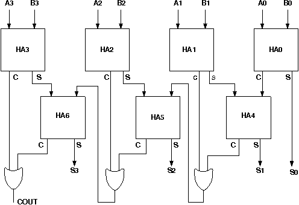

# Procedure

# Assignment Statements :
1. Design a 4-bit carry lookahead adder circuit using half adders and full adders and test it by giving proper input.
2. Design a 16-bit carry lookahead adder circuit using half adders and full adders and test it by giving proper input.

## Circuit diagram of Carry Lookahead Adder:

## Follow the below manual and perform the experiment

- Manual --> [Click Here](./simulation/coavlNew.pdf)

<embed src="./simulation/coavlNew.pdf" type="application/pdf">

