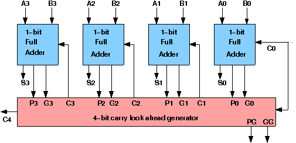

# Theory:

## Design of Carry Lookahead Adders :
To reduce the computation time, there are faster ways to add two binary numbers by using carry lookahead adders. They work by creating two signals **P** and **G** known to be **Carry Propagator** and **Carry Generator**. The carry propagator is propagated to the next level whereas the carry generator is used to generate the output carry ,regardless of input carry. The block diagram of a 4-bit Carry Lookahead Adder is shown here below -

The number of gate levels for the carry propagation can be found from the circuit of full adder. The signal from input carry Cin to output carry Cout requires an AND gate and an OR gate, which constitutes two gate levels. So if there are four full adders in the parallel adder, the output carry C5 would have 2 X 4 = 8 gate levels from C1 to C5. For an n-bit parallel adder, there are 2n gate levels to propagate through.

## Design Issues :

The corresponding boolean expressions are given here to construct a carry lookahead adder. In the carry-lookahead circuit we ned to generate the two signals carry propagator(P) and carry generator(G),

$$P_i=A_i⊕B_i$$

$$ G_i = A_i · B_i $$

The output sum and carry can be expressed as

$$ Sum_i = P_i ⊕ C_i $$

$$ C_{i+1} = G_i + ( P_i · C_i) $$

Having these we could design the circuit. We can now write the Boolean function for the carry output of each stage and substitute for each Ci its value from the previous equations:

$$ C_1 = G_0 + P_0 · C_0 $$

$$ C_2 = G_1 + P_1 · C_1 = G_1 + P_1 · G_0 + P_1 · P_0 · C_0 $$

$$ C_3 = G_2 + P_2 · C_2 = G_2 P_2 · G_1 + P_2 · P_1 · G_0 + P_2 · P_1 · P_0 · C_0 $$

$$ C_4 = G_3 + P_3 · C_3 = G_3 P_3 · G_2 P_3 · P_2 · G_1 + P_3 · P_2 · P_1 · G_0 + P_3 · P_2 · P_1 · P_0 · C_0 $$

